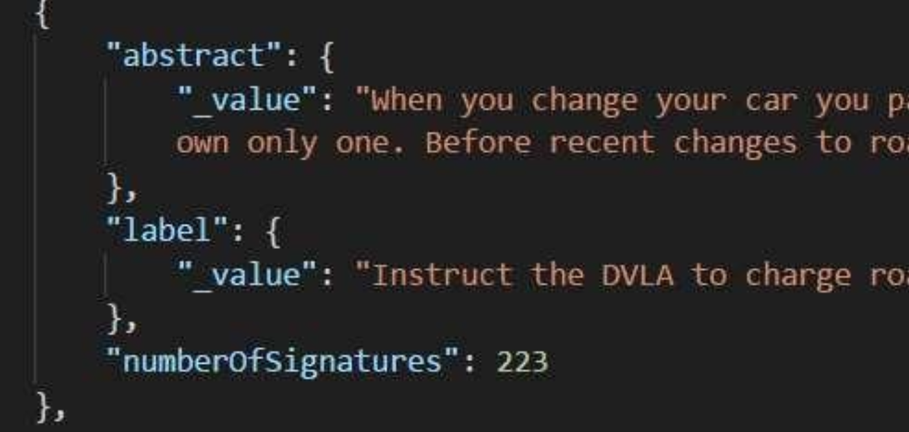

# AV_Task

## I. Task
• Use python or pyspark to transform the input data into the desired outputs.
• Include at least one test.
• Keep best practices in mind.
• Place your code and outputs into a Bitbucket repository or GitHub repository.


## Input Data
The input data is a JSON file containing a set of government petitions. For each petition, we have the label (the title of the petition), the abstract (the main text of the petition), and the number of signatures.



## Output
Create a CSV file with one row per petition, containing the following 21 columns:
- __petition_id__: a unique identifier for each petition (this is not present in the input data and needs to be created)
- __One column for each of the 20 most common words across all petitions__, only counting words of 5 or more letters, storing the count of each word for each petition.

For example, if “government” is one of the 20 most common (5+ letter) words, one column should be titled government. If the first petition includes the word “government” three times, and the second petition does not mention “government”, then the government column should read 3 for the first petition and 0 for the second petition.

Original task: https://github.com/csde-aviva/interview-task/tree/main

## II. Submission

### Petition Preprocessing Script - preprocessing.py

#### Overview

This script preprocesses a JSON dataset containing petitions by extracting, cleaning, and analyzing text from a specified column. It utilizes Spark NLP for text processing tasks like tokenization, lemmatization, and stop word removal. The script generates unique identifiers for each petition using an MD5 hash, counts word occurrences across all petitions, and outputs the results to a CSV file.


#### Steps

- **Reads JSON file** with columns: `abstract`, `label`, and `number_of_signatures` 
- **Cleans `abstract` text column** 
    - **Removes** punctuation and converting it to lowercase.
    - **Tokenizes** the text into individual words.
    - **Removes stop words** to focus on meaningful content.
    - **Lemmatizes** the words to their base forms.
    - **Counts the occurrences** of the most common lemmatized words, filtering by a specified minimum word length.
- **Generates a unique identifier** for each petition using an MD5 hash based on the `label`, first 100 characters of the `abstract`, and `number_of_signatures`.
- **Handles duplicate rows** based on a combination of `abstract`, `label`, and `number_of_signatures`.
- **Outputs** the processed data to a CSV file containing the word counts and petition IDs.

#### Usage

To run the script, use the following command:

```
python pre_processing.py <path_to_json> 
```